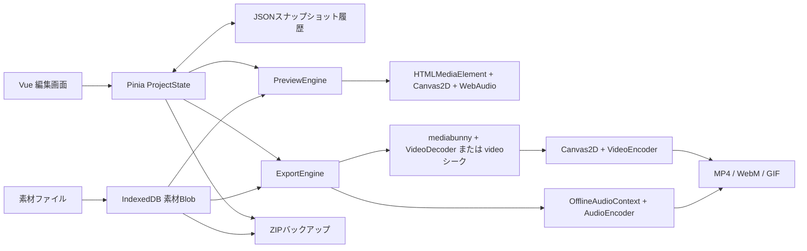

このアプリは、短い動画をブラウザ内で編集する機能を幅広く備えている。一方、現時点で最優先すべきなのは、素材と編集状態を失わないこと、編集操作で意図しない変更を起こさないこと、プレビューと書き出し結果を一致させることの3点である。

調査日: 2026-09-07。対象: package.json上のv0.5.0、調査時の作業ツリー。レビュー時点ではアプリケーションの実装変更は行っていない。

> 2026-09-08 追記: この文書の指摘・コード行番号は改修前の記録です。その後、IndexedDB を廃止する実装を行いました。現在の保存方式と確認済み範囲は [移行の検証記録](session-storage-migration.md) を参照してください。

2026-09-08追記: ユーザーから、GitHub Pagesの標準ドメインで公開する際に、第三者製アプリから素材を読み取られることを懸念していたと確認した。保存機能を再導入する前に、以下のアクセス境界を設計条件とする。

**公開先と素材の機密性**

GitHub Pagesの標準的なプロジェクトURLは`https://<owner>.github.io/<repositoryname>/`である。現在のリポジトリと配信設定をこの規則に当てはめると、本アプリは`https://clostridium81.github.io/local-video-editor/`となる。オリジンはプロトコル・ホスト・ポートで決まり、パスは境界に含まれない。IndexedDBのデータベースはオリジンに属する。[GitHub Pages公式資料](https://docs.github.com/en/pages/getting-started-with-github-pages/what-is-github-pages)、[IndexedDBのアクセス境界](https://developer.mozilla.org/en-US/docs/Web/API/IndexedDB_API/Basic_Terminology)。

| 別アプリの場所 | 本アプリのIndexedDBへの直接アクセス |
|---|---|
| `https://another-user.github.io/app/` | 別オリジンのため通常は不可 |
| `https://clostridium81.github.io/other-app/` | 同一オリジンのため可能 |
| `https://clostridium81.github.io/` | 同一オリジンのため可能 |

ここでいうアクセスは、素材を取り込んだ利用者と同じブラウザプロファイル・保存領域で、その別アプリのJavaScriptが実行された場合を指す。素材がGitHubへアップロードされたり、他の利用者から公開データとして取得できたりするという意味ではない。同じアカウント配下へ配置した第三者製アプリや、同配下の別サイトでのXSS・依存スクリプト侵害が脅威となる。実際に侵害や読み取りを観測したものではない。[同一オリジンポリシー](https://developer.mozilla.org/en-US/docs/Web/Security/Defenses/Same-origin_policy)。

現実装のDB名`local-video-editor`やprojectIdによるキー分離には、同一オリジンの別アプリへのアクセス制御効果はない。自動保存・自動復元の廃止も、素材Blobの保存を残しているためこの脅威を解消しない。起動時の削除は編集中のアクセスを防がず、次回起動までのデータ残留もある。[assetStore.ts:15](/Users/yui.abe/Downloads/programming/local-video-editor/src/persistence/assetStore.ts:15) [assetStore.ts:57](/Users/yui.abe/Downloads/programming/local-video-editor/src/persistence/assetStore.ts:57) [main.ts:11](/Users/yui.abe/Downloads/programming/local-video-editor/src/main.ts:11)

推奨する判断順序は、まずアプリ専用オリジンを確保できるかを検討し、次に永続保存の要否を決めること。専用サブドメインや、このアプリ専用のGitHubユーザー／組織のPagesホストで、他のアプリとオリジンを分けられる。独自ドメインを取得するだけで同一ホストの別パスへ複数アプリを配置し続ける場合は分離されない。

現在のホストを維持して素材を保存領域に残さない方針を採る場合は、素材をセッション内のFile／Blob参照で管理し、保存は手動ZIPに限定する。その場合は既存IndexedDB素材の扱い、persist要求、キャッシュ、バックアップ処理も一緒に見直す。ただしメモリ管理への移行だけでXSSや同一オリジンのウィンドウ間アクセスまで防げるわけではなく、専用オリジンと同等の隔離にはならない。本追記は設計上の選択肢を示すもので、移行やデータ削除を実施したものではない。

**設計の把握**

Vue 3の画面からPiniaのProjectStateを操作し、素材本体だけをIndexedDBに格納する。Assetは素材、Clipは素材の使用区間・配置・効果を表す。時刻は秒、映像位置は正規化座標、文字サイズなどはピクセルで保持する。編集状態はJSON化可能で、履歴とZIPバックアップがこのモデルを共有する。

この分離は有効であり、素材を再利用でき、サーバー側の動画処理も不要。書き出しの遅延ロード、デコーダの同時数制限、映像エンコードのキュー制御、フレームの解放、計測用プロファイラも実装されている。問題は、状態変更・描画・時間変換の規則が複数箇所に分散している点にある。[project.ts:1](/Users/yui.abe/Downloads/programming/local-video-editor/src/types/project.ts:1) [frameSource.ts:38](/Users/yui.abe/Downloads/programming/local-video-editor/src/engine/frameSource.ts:38) [exportEngine.ts:804](/Users/yui.abe/Downloads/programming/local-video-editor/src/engine/exportEngine.ts:804)

ProjectStateの自動保存・自動復元は現在の仕様で明示的に廃止されている。自動保存がないこと自体は実装漏れではなく、耐障害性とのトレードオフである。design.mdには古い自動保存方針や未実装扱いの完了機能が残っており、README・実装との整理が必要。[main.ts:11](/Users/yui.abe/Downloads/programming/local-video-editor/src/main.ts:11) [design.md:8](/Users/yui.abe/Downloads/programming/local-video-editor/design.md:8) [README.md:5](/Users/yui.abe/Downloads/programming/local-video-editor/README.md:5)

**検証範囲と確度**

- `npm run build`: 型チェック、本番ビルドとも成功。
- 既存スモークテスト: 89項目成功。`npm run smoke`はこの実行環境のtsx用IPCソケット制限で起動できなかったため、同じファイルを`node --import tsx scripts/smoke-test.ts`で実行した。
- 追加検証: 実際のストア・ZIP・描画・音声スケジュール関数を実行。IndexedDBをメモリ上のMap、メタデータ取得を固定値、Canvas・WebAudioを呼び出し記録用の代替に置き換えた。実ブラウザでの保存や画像・音声出力そのものを検証したものではない。
- キーフレームの不具合は、置き換えなしの実関数でも直接再現した。
- ブラウザの画面操作、実動画のエンコード、実機での視聴、長時間の耐久試験は未実施。性能数値はローカルNode.js上の限定測定であり、ブラウザ全体の実測fpsではない。

以下の「再現」は上記のロジック検証、「コード確認」は実装経路から確認したもの、「要実機確認」はブラウザ・素材条件の影響が残るものを表す。P0は素材・作品の保全に関わる最優先、P1は編集・出力の正確性、P2は操作性・互換性の改善。

**不具合・機能上のボトルネック**

| ID | 優先度・確度 | 発生条件と問題 | 対応方針・完了条件 |
|---|---|---|---|
| F01 | P0・コード確認 | タブAで素材を読み込んだあと、同一オリジンのタブBで起動すると、起動処理が共有IndexedDBの全素材を削除する。Aの既存Blob URLで表示が続いていても、後のバックアップ・音声書き出しが素材を取得できなくなる。 | セッション所有権と稼働中タブを管理し、破棄可能なセッションだけ掃除する。Aでの編集中にBを開いてもAの素材読み込み・完全ZIP作成が成功すること。[main.ts:16](/Users/yui.abe/Downloads/programming/local-video-editor/src/main.ts:16) [assetStore.ts:117](/Users/yui.abe/Downloads/programming/local-video-editor/src/persistence/assetStore.ts:117) |
| F02 | P0・再現 | 素材追加・削除は履歴外なのに、Undoはassetsを含む状態全体を復元する。編集→素材追加→Undoで追加素材のメタデータが消える。素材削除→Undoではメタデータとクリップだけが戻り、削除済みBlobは戻らない。 | 素材も含めたコマンド履歴、または履歴中に参照されるBlobの遅延削除を導入する。「素材を含むUndo」の仕様を統一し、参照先が欠けないこと。[projectStore.ts:157](/Users/yui.abe/Downloads/programming/local-video-editor/src/stores/projectStore.ts:157) [projectStore.ts:175](/Users/yui.abe/Downloads/programming/local-video-editor/src/stores/projectStore.ts:175) [projectStore.ts:212](/Users/yui.abe/Downloads/programming/local-video-editor/src/stores/projectStore.ts:212) |
| F03 | P0・再現 | ZIP作成時、素材Blobがないと警告ログだけでスキップして成功する。呼び出し元がその状態を「バックアップ済み」にする。検証では素材1件を持つ状態から素材0件のZIPが作られ、未保存判定もfalseになった。 | 素材数・サイズ・参照を検証し、不完全なZIPでは成功扱い・保存済み更新をしない。保存ダイアログのキャンセルを検出できないダウンロード方式では、通知を「ダウンロードを開始」に合わせる。[backup.ts:73](/Users/yui.abe/Downloads/programming/local-video-editor/src/persistence/backup.ts:73) [TopBar.vue:37](/Users/yui.abe/Downloads/programming/local-video-editor/src/components/TopBar.vue:37) |
| F04 | P0・再現／コード確認 | ZIP復元はmanifestだけを検査し、project.jsonを型アサーションで受け入れる。`{}`や、素材メタデータはあるが素材ファイルのないZIPもimportBackupから正常に返る。素材は1件ずつ本番IDに書き込み、途中失敗時の巻き戻しもない。 | スキーマ・有限数・ID一意性・トラック種別・素材参照・総展開量を検証。別領域へ読み込み、全検証と保存成功後に切り替える。不正ZIPで現作品を壊さないこと。[backup.ts:120](/Users/yui.abe/Downloads/programming/local-video-editor/src/persistence/backup.ts:120) [TopBar.vue:80](/Users/yui.abe/Downloads/programming/local-video-editor/src/components/TopBar.vue:80) |
| F05 | P1・再現 | 2秒ずつ連続するA/B/C/DからAとCをリップル削除すると、削除区間の外接範囲0～6秒を一括で詰めるため、Dが0秒、Bが2秒となり、残したクリップの順番が逆転する。他トラックも無条件で移動する。 | 削除区間の和集合と対象トラックを明示し、各後続クリップにはその時点以前の削除時間だけを適用する。重なり・離れた選択・リンクされた音声も検証する。[projectStore.ts:778](/Users/yui.abe/Downloads/programming/local-video-editor/src/stores/projectStore.ts:778) |
| F06 | P1・再現 | リンクした2クリップを複製するとlinkGroupを引き継ぎ、コピー側のリンク相手が元を含む4クリップになる。コピーを動かすと元も移動し得る。 | 複製単位でlinkGroupを新規発行し、コピー内だけで関係を再構築する。一部だけコピーした場合のリンク解除規則も決める。[projectStore.ts:441](/Users/yui.abe/Downloads/programming/local-video-editor/src/stores/projectStore.ts:441) [projectStore.ts:770](/Users/yui.abe/Downloads/programming/local-video-editor/src/stores/projectStore.ts:770) |
| F07 | P1・再現 | 最後のキーフレームより後で分割すると右側のkeyframesがundefinedになり、値がクリップの基本値へ戻る。検証では分割前1.0が分割後0.5になった。またeaseIn区間の分割で同一時刻の値が0.0625から0.125に変わった。 | 両側に必要な境界値を保持し、分割前後で曲線を保存する。全プロパティ・全easingについて任意時刻の評価値が一致すること。[keyframes.ts:119](/Users/yui.abe/Downloads/programming/local-video-editor/src/engine/keyframes.ts:119) [projectStore.ts:390](/Users/yui.abe/Downloads/programming/local-video-editor/src/stores/projectStore.ts:390) |
| F08 | P1・コード確認 | 左トリムはstart/duration/sourceInだけを変更し、ローカル時刻のキーフレームを移動しないため、残した素材のアニメーションのタイミングが変わる。左端を戻す制約にもstart>=0がなく、sourceInが大きいクリップを0秒より左へ伸ばせる。 | 素材の使用区間とアニメーション時刻を一緒にトリムする処理をストアへ集約。キーフレーム追従の仕様とタイムライン0秒制約を保証する。[TimelinePanel.vue:260](/Users/yui.abe/Downloads/programming/local-video-editor/src/components/TimelinePanel.vue:260) |
| F09 | P1・コード確認 | 速度変更はクリップ長を変えない仕様だが、素材末尾の制約も更新しない。10秒素材を10秒配置して2倍速にすると、後半は素材範囲外を要求する。Inspectorの長さ・素材開始位置にも素材上限がない。 | 「長さを維持／素材範囲を維持」を選べるようにし、範囲外は拒否・短縮・静止保持のいずれかを明示する。[InspectorPanel.vue:215](/Users/yui.abe/Downloads/programming/local-video-editor/src/components/InspectorPanel.vue:215) [InspectorPanel.vue:478](/Users/yui.abe/Downloads/programming/local-video-editor/src/components/InspectorPanel.vue:478) |
| F10 | P1・再現 | 1080pから720pへ出力すると、映像・図形は解像度に合わせて変わるが文字は72pxのまま。相対的な文字サイズが1.5倍になり、字幕の位置関係や収まりが変わる。縁取り・影・ブラー等にもpx単位の値が残る。 | プロジェクトの基準座標で合成して出力サイズへ変換するか、すべてのpx値を一貫して変換する。同一アスペクト比の出力で構図が一致すること。[exportEngine.ts:838](/Users/yui.abe/Downloads/programming/local-video-editor/src/engine/exportEngine.ts:838) [exportEngine.ts:396](/Users/yui.abe/Downloads/programming/local-video-editor/src/engine/exportEngine.ts:396) |
| F11 | P1・再現 | カラーグレード／画素効果を使う経路では、オフスクリーン描画と最終描画の両方に同じCanvas filterが設定される。呼び出し記録ではbrightness(2)を2回適用していた。効果を追加しただけで明るさ・コントラスト・ブラー等が過剰になる。プレビューと書き出しの両方に同型の実装がある。 | ピクセル処理の前後を含めて効果の順序を定義し、各フィルターを1回だけ適用する。既知RGB入力で結果を比較する。[previewEngine.ts:622](/Users/yui.abe/Downloads/programming/local-video-editor/src/engine/previewEngine.ts:622) [exportEngine.ts:256](/Users/yui.abe/Downloads/programming/local-video-editor/src/engine/exportEngine.ts:256) |
| F12 | P1・再現／コード確認 | 0～2秒の音声フェードインを1秒から範囲出力すると、本来0.5で始まる音量が0から始まる。負の予約時刻を単に0へ詰めているため。音量キーフレームとフェードも同じAudioParamへ別々に予約され、プレビューの乗算と一致しない。 | 絶対時刻からvolume×transitionを評価する共通関数を用意し、範囲開始時点の実効値から予約する。[exportEngine.ts:629](/Users/yui.abe/Downloads/programming/local-video-editor/src/engine/exportEngine.ts:629) [previewEngine.ts:357](/Users/yui.abe/Downloads/programming/local-video-editor/src/engine/previewEngine.ts:357) |
| F13 | P1・コードとAPI仕様から判断、要実機確認 | 速度変更時、プレビューはHTMLMediaElement、出力はAudioBufferSourceNodeを使う。前者のpreservesPitchを設定せず、後者にはピッチ保持処理がないため、プレビューと出力で声の高さが変わる条件がある。 | ピッチ保持の仕様を明示して両経路を揃える。必要なら時間伸縮処理を共有し、440Hz音源と音声で0.5/1/2倍を検証する。[previewEngine.ts:410](/Users/yui.abe/Downloads/programming/local-video-editor/src/engine/previewEngine.ts:410) [exportEngine.ts:616](/Users/yui.abe/Downloads/programming/local-video-editor/src/engine/exportEngine.ts:616) |
| F14 | P1・コード確認 | 画像・動画・音声の取得やデコード失敗がログ／nullで処理され、黒画面・無音を含む出力でも完了まで進み得る。音声ミックス失敗も握りつぶす。 | 「音声トラックなし」と「音声デコード失敗」を区別し、必須素材の欠損は中止する。部分出力には欠損区間・素材名を明示した選択肢を用意する。[frameSource.ts:298](/Users/yui.abe/Downloads/programming/local-video-editor/src/engine/frameSource.ts:298) [exportEngine.ts:568](/Users/yui.abe/Downloads/programming/local-video-editor/src/engine/exportEngine.ts:568) [exportEngine.ts:945](/Users/yui.abe/Downloads/programming/local-video-editor/src/engine/exportEngine.ts:945) [exportEngine.ts:1003](/Users/yui.abe/Downloads/programming/local-video-editor/src/engine/exportEngine.ts:1003) |
| F15 | P1・コード確認、要実機確認 | 録画ダイアログは録画中に閉じるボタンを無効化しているが、背景クリックでは閉じられる。stopStreamがmediaRecorderをnullにし、停止イベント側がそれを参照する。TTSのローカル変数stream/recは共通の終了処理から管理されず、例外・閉じる操作で確実に停止するfinallyもない。 | 録画・TTSを単一のライフサイクルで管理し、停止完了まで録画形式とストリームを保持する。背景クリック、共有停止、エラー、連打、マイク拒否を検証する。素材追加がnullを返した場合に成功通知を出す経路も直す。[RecorderDialog.vue:123](/Users/yui.abe/Downloads/programming/local-video-editor/src/components/RecorderDialog.vue:123) [RecorderDialog.vue:175](/Users/yui.abe/Downloads/programming/local-video-editor/src/components/RecorderDialog.vue:175) [RecorderDialog.vue:229](/Users/yui.abe/Downloads/programming/local-video-editor/src/components/RecorderDialog.vue:229) |
| F16 | P2・コード確認 | 書き出し対応判定はダイアログ初回だけで、その後の形式・fps・解像度変更に追従しない。判定はH.264 Level 4.0固定なのに実出力は60fps時に4.2を選ぶ。映像だけやGIFもAudioEncoderの存在を要求してしまう。 | 選択中の実設定と同じ設定生成関数で再判定し、映像・音声・GIF・デコードの能力判定を独立させる。[ExportDialog.vue:165](/Users/yui.abe/Downloads/programming/local-video-editor/src/components/ExportDialog.vue:165) [capabilities.ts:5](/Users/yui.abe/Downloads/programming/local-video-editor/src/engine/capabilities.ts:5) [exportEngine.ts:835](/Users/yui.abe/Downloads/programming/local-video-editor/src/engine/exportEngine.ts:835) |
| F17 | P2・呼び出し再現／コード確認 | テキスト入力はtextareaだが、描画は全文を1回のfillTextへ渡すか文字ごとに横並びで描く。改行・自動折り返しをレイアウトしておらず、lineHeightも背景の高さにしか反映されない。 | 改行、最大幅、自動折り返し、行揃え、字間、禁則処理を共通テキストレイアウトへまとめる。[InspectorPanel.vue:632](/Users/yui.abe/Downloads/programming/local-video-editor/src/components/InspectorPanel.vue:632) [previewEngine.ts:734](/Users/yui.abe/Downloads/programming/local-video-editor/src/engine/previewEngine.ts:734) [exportEngine.ts:461](/Users/yui.abe/Downloads/programming/local-video-editor/src/engine/exportEngine.ts:461) |
| F18 | P2・コード確認 | ミキサーのメーターは実音声ではなく素材波形からの推定最大値。ミュート・ソロ・EQ・フェード・音量キーフレームや複数音源の実合成を反映せず、マスターも各トラックの最大値だけ。音割れを見逃す。 | 実際の音声グラフからピーク／RMSを測定する。実測できない場合は「推定レベル」と表示し、出力時のラウドネス検査を追加する。[AudioMixer.vue:14](/Users/yui.abe/Downloads/programming/local-video-editor/src/components/AudioMixer.vue:14) [AudioMixer.vue:25](/Users/yui.abe/Downloads/programming/local-video-editor/src/components/AudioMixer.vue:25) |

F13の根拠: HTMLMediaElementのpreservesPitchは既定でtrue。一方、AudioBufferSourceNode.playbackRateは再サンプリングによる速度変更である。この仕様差とアプリの実装から不一致を判断したもので、今回実音声を聴き比べた結果ではない。[HTMLMediaElementの仕様説明](https://developer.mozilla.org/en-US/docs/Web/API/HTMLMediaElement/preservesPitch)、[AudioBufferSourceNodeの仕様説明](https://developer.mozilla.org/en-US/docs/Web/API/AudioBufferSourceNode/playbackRate)。

ほかに、互換映像トラックがない状態ではテキスト・図形が音声トラックへ配置されて非表示になる経路を再現した。ただし通常UIにトラック削除機能は見当たらず、主に読み込んだプロジェクトに対する堅牢性の問題である。[projectStore.ts:317](/Users/yui.abe/Downloads/programming/local-video-editor/src/stores/projectStore.ts:317) [projectStore.ts:794](/Users/yui.abe/Downloads/programming/local-video-editor/src/stores/projectStore.ts:794)

READMEの「クリップ単位の逆再生」は現UIの正速度スライダーからは設定できない。Jキーの逆方向プレビューとは別の機能である。型にはlockedがあるが、ロックUIと各変更処理の制約は未実装。これらは提供済み機能との混同を避けるため、仕様と表示を合わせる必要がある。[InspectorPanel.vue:917](/Users/yui.abe/Downloads/programming/local-video-editor/src/components/InspectorPanel.vue:917) [project.ts:303](/Users/yui.abe/Downloads/programming/local-video-editor/src/types/project.ts:303)

**非機能面のボトルネック**

| 項目 | 根拠・影響 | 改善候補 |
|---|---|---|
| 描画負荷 | エフェクトはメインスレッドの全画素ループ。Canvasを画面上で小さく表示しても内部解像度はプロジェクトのまま。拡大クリップでは描画サイズ分の巨大な作業バッファも確保する。[previewEngine.ts:183](/Users/yui.abe/Downloads/programming/local-video-editor/src/engine/previewEngine.ts:183) [previewEngine.ts:640](/Users/yui.abe/Downloads/programming/local-video-editor/src/engine/previewEngine.ts:640) | プレビュー解像度1/2・1/4、自動品質調整、画面外領域の処理削減。効果のGPU化とWorker化を段階導入する。OffscreenCanvasを使うだけでは別スレッド実行にはならない。 |
| 全時間分のメモリ | ZIPは全素材をUint8Arrayへ読み込み、圧縮レベル6で一括作成。書き出しは動画出力をArrayBufferに保持し、音声は各素材のPCMと全出力長のPCMを保持する。[backup.ts:17](/Users/yui.abe/Downloads/programming/local-video-editor/src/persistence/backup.ts:17) [backup.ts:73](/Users/yui.abe/Downloads/programming/local-video-editor/src/persistence/backup.ts:73) [exportEngine.ts:555](/Users/yui.abe/Downloads/programming/local-video-editor/src/engine/exportEngine.ts:555) [exportEngine.ts:875](/Users/yui.abe/Downloads/programming/local-video-editor/src/engine/exportEngine.ts:875) | 圧縮済み映像の再圧縮を省略できるようにし、ZIP・mux出力をストリーム化。音声は範囲内素材だけをデコードしてチャンク処理。出力長・解像度に応じた容量見積もりを表示する。 |
| 音声のキュー上限 | 映像側にはキュー待ちがあるが、音声は1024サンプル単位で投入し続ける。UIへyieldしてもキュー上限にはならない。[exportEngine.ts:1031](/Users/yui.abe/Downloads/programming/local-video-editor/src/engine/exportEngine.ts:1031) | AudioEncoderにもキュー上限・エラー伝播・キャンセルを導入する。 |
| 再生中の状態監視 | playheadも含むdeep watchが毎フレーム走り、全クリップの走査・ノード掃除・並べ替えも繰り返す。素材ノードはクリップが存在する間保持する。[PreviewPanel.vue:110](/Users/yui.abe/Downloads/programming/local-video-editor/src/components/PreviewPanel.vue:110) [previewEngine.ts:192](/Users/yui.abe/Downloads/programming/local-video-editor/src/engine/previewEngine.ts:192) [previewEngine.ts:315](/Users/yui.abe/Downloads/programming/local-video-editor/src/engine/previewEngine.ts:315) | 再生時刻と編集データを分離し、編集revisionで更新する。トラック索引・区間索引を持ち、デコード資源は現在時刻付近のみを保持する。 |
| タイムライン・波形 | 全クリップと全期間の目盛りを描画。波形Canvas幅はduration×zoomで上限がなく、1時間×500px/sでは180万px幅になる。波形生成も素材全体をデコードし、各素材の処理を並行開始する。[TimelinePanel.vue:48](/Users/yui.abe/Downloads/programming/local-video-editor/src/components/TimelinePanel.vue:48) [TimelinePanel.vue:626](/Users/yui.abe/Downloads/programming/local-video-editor/src/components/TimelinePanel.vue:626) [TimelinePanel.vue:650](/Users/yui.abe/Downloads/programming/local-video-editor/src/components/TimelinePanel.vue:650) | 可視区間だけ描画する仮想化、波形のタイル化・複数解像度キャッシュ、波形生成の同時数制限。キャッシュ破棄関数を素材削除・プロジェクト切替につなぐ。 |
| 非同期競合・同期精度 | renderAtを待たず次のrequestAnimationFrameを予約する。seekOnlyはseekedを待たず描く。遅い素材読み込み中に古い描画が後から完了する可能性がある。再生時は0.2秒超のずれでシーク補正する。[previewEngine.ts:252](/Users/yui.abe/Downloads/programming/local-video-editor/src/engine/previewEngine.ts:252) [previewEngine.ts:417](/Users/yui.abe/Downloads/programming/local-video-editor/src/engine/previewEngine.ts:417) [previewEngine.ts:457](/Users/yui.abe/Downloads/programming/local-video-editor/src/engine/previewEngine.ts:457) | 同時描画は1件に制限し、要求番号で古い結果を破棄。シーク完了／実フレーム到着を待ち、音声を基準時計とする同期方式を検討する。音ズレ・ちらつきの程度は要実測。 |
| 中断・停止の応答 | 素材loadeddata待ち、画像ロード、音声startRendering等へAbortSignalが伝わらない。エンコードキュー待ちにもキャンセルや最大時間がない。デコーダ取得自体にはタイムアウトがある。[frameSource.ts:46](/Users/yui.abe/Downloads/programming/local-video-editor/src/engine/frameSource.ts:46) [exportEngine.ts:699](/Users/yui.abe/Downloads/programming/local-video-editor/src/engine/exportEngine.ts:699) [exportEngine.ts:807](/Users/yui.abe/Downloads/programming/local-video-editor/src/engine/exportEngine.ts:807) | 各非同期待ちを中断可能にし、ロード・ミックス・エンコード・muxの各段階で停止と解放を保証する。 |
| 履歴と変更検知 | 100件までの全状態JSONスナップショット。保存済み判定も内容全体をJSON化・ハッシュ化する。履歴のmergeは有効だが、モデルが大きくなるほど編集コストとメモリが増える。[history.ts:13](/Users/yui.abe/Downloads/programming/local-video-editor/src/stores/history.ts:13) [backupSignature.ts:37](/Users/yui.abe/Downloads/programming/local-video-editor/src/stores/backupSignature.ts:37) | 操作単位の差分履歴、一定間隔のスナップショット、編集revisionによる保存状態判定。資産管理との整合性を先に解決する。 |
| 障害からの復旧 | 編集内容はメモリのみ。persist要求はブラウザによるストレージ退避への対策であり、アプリ自身の全削除や編集状態消失は防がない。[App.vue:91](/Users/yui.abe/Downloads/programming/local-video-editor/src/App.vue:91) [main.ts:16](/Users/yui.abe/Downloads/programming/local-video-editor/src/main.ts:16) | 現行「手動ZIPのみ」を維持する場合も、破損しないZIPと検証付き保存を最優先。永続保存によるクラッシュ復旧は、専用オリジンと保存方針を決めてから検討する。 |
| オフラインとローカル処理の保証 | Service Workerによる事前キャッシュはなく、初めて使う出力形式やmediabunnyは遅延取得する。Webフォントも外部依存。TTSはすべてのvoiceを候補にしlocalServiceを検査しない。 | 必要チャンク・フォント・任意モデルを事前キャッシュし、オフライン準備完了を表示。TTSは端末内音声に限定するか、リモート利用を区別して明示する。[mediabunnyLoader.ts:1](/Users/yui.abe/Downloads/programming/local-video-editor/src/engine/mediabunnyLoader.ts:1) [global.css:1](/Users/yui.abe/Downloads/programming/local-video-editor/src/styles/global.css:1) [RecorderDialog.vue:33](/Users/yui.abe/Downloads/programming/local-video-editor/src/components/RecorderDialog.vue:33) |
| 保守性・品質保証 | preview/exportの文字・図形・効果・音声計算が部分的に重複。1000行超のエンジン・ストア・UIが複数存在する。CIは型チェックとビルドだけでsmokeすら実行していない。[deploy.yml:25](/Users/yui.abe/Downloads/programming/local-video-editor/.github/workflows/deploy.yml:25) | 時間・座標・描画・音量評価を共通化。保存復元／編集不変条件／出力比較をCIで検証し、ブラウザ別の実機試験を補う。 |

beforeunloadは、特にモバイルで必ず発火するわけではなく、保存の代わりにはならない。[MDNのイベント制約](https://developer.mozilla.org/en-US/docs/Web/API/Window/beforeunload_event)。また、SpeechSynthesisVoiceにはリモートサービス由来の音声もあり、現実装から「通信はフォントのみ」を保証できない。実際の送信の有無は選択音声と端末依存で、今回の調査では送信を観測していない。[localServiceの仕様説明](https://developer.mozilla.org/en-US/docs/Web/API/SpeechSynthesisVoice/localService)。

**限定的な性能測定**

Node.js v22.22.2、合成した均一画像、ウォームアップ1回後の5回の中央値。効果はvignette=0.35、grain=0.1、sharpen=0.2。デコード・Canvas転送・Vue・エンコード時間を含まない。

| 入力 | 画素効果処理のみ | RGBAバッファ1枚 |
|---|---:|---:|
| 1920×1080 | 65.70ms | 約8.29MB |
| 3840×2160 | 277.81ms | 約33.18MB |

30fpsは1フレーム約33.3ms、60fpsは約16.7ms。この測定条件では画素効果だけで予算を超えており、まず低解像度プレビューを導入する理由がある。実際の対応可能解像度・fpsはブラウザと端末で別途測定する必要がある。

1000クリップ×各20キーフレームの合成状態はJSON約1.02MB、内容署名算出の中央値約4.41msだった。100履歴なら文字列の総量だけでも約102MB相当となる。実際のJSメモリ使用量は文字列表現・付随オブジェクトによって異なる。

48kHz・ステレオ・Float32のPCMは10分で約230.4MB、1時間で約1.38GB。現在は全出力PCMに加えて素材PCMも保持するため、長尺では映像のビットレートを下げるだけでは解消しない。

**追加可能な機能・仕様**

既存のマルチトラック、Undo、キーフレーム、グリッド／安全ガイド、スナップ、エフェクト、用途別出力プリセットを前提に、追加価値があるものを挙げる。規模は実装と検証を含む相対評価で、日数の見積もりではない。

| 優先順 | 機能・仕様 | ユーザーへの効果／具体的な範囲 | 規模 |
|---|---|---|---|
| 1 | 安心して再開できる保存 | 検証済みZIP、欠損素材一覧、素材再リンク、保存世代・保存時点表示。ブラウザへの永続保存を伴うクラッシュ復旧・最近の作品は、専用オリジンと保存方針の決定まで採用を保留する。 | 中～大 |
| 2 | プロジェクト設定 | 作成時に16:9／9:16／1:1／4:5、fps、背景を選択。読み込み素材との不一致を説明し、fit／fill／cropを選べる。今はupdateProjectMetaがUIから使われていない。 | 中 |
| 3 | 軽量プレビュー | 表示品質1/2・1/4・自動、動画プロキシ、効果の一時バイパス、再生品質表示。編集用と出力用の解像度を分離する。 | 中～大 |
| 4 | 字幕編集 | 複数行字幕、SRT／WebVTT入出力、時間合わせ、読みやすい字幕スタイル、安全領域内への配置。端末内の自動文字起こしはモデル容量・処理時間を説明した任意追加にする。 | 中／自動化は大 |
| 5 | 音声品質の基礎 | 実ピークメーター、音割れ防止リミッター、ラウドネス調整、短いクロスフェード、ピッチ保持の速度変更。出力前にクリッピングと無音区間を確認できるようにする。 | 中～大 |
| 6 | 精密なトリム | フレーム単位のイン点・アウト点、ソースモニター、前後フレーム確認、スリップ／ローリングトリム。リップルは対象トラック・リンク関係を表示する。 | 中 |
| 7 | 出力前検査 | 欠損素材、デコード可否、範囲外の素材参照、フォント未準備、音声有無、出力設定対応を開始前に検査。短い区間の試し書き出しと出力後プレビューを用意する。 | 中 |
| 8 | 構図調整 | クロップ、反転、中央／端揃え、等間隔配置、複数オブジェクトの整列、縦動画への手動リフレーミング。自動追尾は後段にする。 | 中 |
| 9 | キーフレーム編集UI | 専用レーン、複数選択・移動・コピー、補間曲線、ベジェ調整、プロパティごとのリセット。まず分割／トリム不変条件を直してから追加する。 | 中～大 |
| 10 | 本来のクロスディゾルブ | クリップの入／出フェードに加え、隣接クリップ間の重なり時間・素材余白を扱うトランジション。音声は等電力クロスフェードも選択できる。 | 中 |
| 11 | 音声の仕上げ | BGM自動ダッキング、ノイズ低減、コンプレッサー、音声／BGM別のプリセット。プレビューと出力で同じ処理を使う。 | 中～大 |
| 12 | 色の調整と確認 | ヒストグラム、RGBパレード、波形／ベクトルスコープ、ホワイトバランス、カーブ、LUT。素材の色域・転送特性を保持し、HDR→SDRの扱いを明示する。 | 中～大 |
| 13 | 動きの品質 | 速度ランプ、フリーズフレーム、実クリップの逆再生、安定化。スロー時のフレームブレンド／動き補間は処理負荷とアーティファクトを比較して任意提供。 | 中～大 |
| 14 | 大きな作品の整理 | トラックの名前変更・順序変更・削除・ロック・映像表示切替、素材フォルダ、使用中表示、タイムラインのサムネイル、調整レイヤー、ネストしたシーケンス。 | 中～大 |
| 15 | 操作を覚えやすくする | 日本語モードに応じた表示情報量、空状態からの作業案内、ショートカット変更、モーダルのフォーカス管理、キーボードだけでの編集、Pointer Eventsによるタッチ／ペン対応。 | 中 |
| 16 | 書き出し設定の拡張 | fpsと解像度を考慮したビットレート、対応するコーデックだけの候補表示、音声のみ／静止画出力、複数形式のキュー、保存先指定。高解像度対応は色管理・メモリ制御・コーデック設定の検証とセットにする。 | 中～大 |

BackupReminderDialogは、25回の編集を数えて割り込みモーダルを出す方式。次の改善候補は「最後のバックアップ時点」「経過時間」「未保存の内容」を分かりやすく表示し、ドラッグ中・録画中・書き出し中は通知を保留すること。通常は編集を遮らないバナーにし、保存先や再バックアップ方法へすぐ移れる導線を作る。現状は素材の追加が編集回数に入らず、resetToEmpty/replaceStateも編集カウントを初期化しないため、回数は厳密な未保存作業量を表さない。[projectStore.ts:129](/Users/yui.abe/Downloads/programming/local-video-editor/src/stores/projectStore.ts:129) [projectStore.ts:617](/Users/yui.abe/Downloads/programming/local-video-editor/src/stores/projectStore.ts:617) [BackupReminderDialog.vue:14](/Users/yui.abe/Downloads/programming/local-video-editor/src/components/BackupReminderDialog.vue:14)

**実装を進める順序と確認すべき基準**

| 段階 | 着手内容 | 完了を判断する基準の例 |
|---|---|---|
| 1: 素材・作品の保全 | オリジン分離・素材の保存方針、F01～F04、保存処理の統一 | 別アプリからのアクセスと保存データの残留に対する要件を満たす。2タブ並行操作、素材追加削除とUndo、欠損／不正ZIP、容量不足で作品と素材参照が壊れない。不完全バックアップを成功扱いしない。 |
| 2: 編集・出力の一致 | F05～F14、時間・座標・描画・音量評価の共通化 | 分割前後の任意時刻で値が不変。720p／1080pで構図一致。範囲出力が全体出力の対応区間と一致。速度変更のピッチ仕様が一致。 |
| 3: 操作を止めない | 低解像度プレビュー、波形仮想化、キュー制御、キャンセル、録画終了処理 | 基準端末・素材を固定して、操作応答p95、ドロップフレーム率、メモリ最大値、書き出し時間／動画長、キャンセル応答を測る。数値目標はここで合意する。 |
| 4: 表現力・仕上げ | 字幕、縦動画、音声品質、精密トリム、カラー管理 | 代表的な作品を作り、編集から再読み込み・出力まで一貫して使える。新機能ごとにプレビュー／出力の差分検査を追加する。 |

検証用素材は、短い時刻焼き込み動画＋音声クリック、複数fps（24/30/60/30000÷1001）、可変fps、回転情報付きMOV、無音動画、ステレオ／モノラル、複数行日本語と絵文字、10分以上の長尺を含める。Chrome／Edge／Safari／Firefoxで実際に使う設定の対応表を作る。画像比較・音声比較は非圧縮の合成段階とエンコード後を分け、圧縮誤差まで完全一致を要求しない。

セキュリティ監査は本調査で行った操作について実施した。ローカルコードの読み取り・合成データでの検証・公開API資料の参照・レポート作成のみで、ユーザー素材の外部送信や外部アプリへの書き込みは行っていない。これは作業者自身による操作の自己監査であり、アプリ全体の安全性を保証するものではない。
